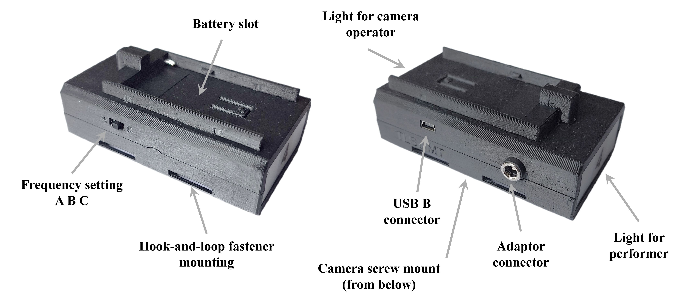

# Tally Light System 
## Funkcie
* 6 vizuálnych signálov
    * Active - červená
    * Preview - zelená
    * Pripravený - modrá
    * Volanie - blikajúca žltá
    * Pripájanie na strižňu - fialová/modrá
    * Strata spojenia - fialová
* Viac možností napájania
* Viac možností montáže
* Tri konfigurovateľné frekvenčné kanály v pásme 433 MHz

## Užívateľský návod
### Nastavenie
1. Pripojte napájací zdroj a ethernetový kábel k vysielaču.
2. Priradenie IP adresy:
    * Pripojený router by mal priradiť TLS IP adresu
    * Ak nie je prítomný DHCP server (router), vysielač si po **10 sekundách** od pripojenia ethernetového kábla nastaví statickú IP adresu **192.168.74.99**
3. Otvorte prehliadač na počítači, ktorý je pripojený do rovnakej siete ako TLS.
4. Zadajte IP adresu TLS (dynamickú z DHCP alebo statickú **192.168.74.99**)
5. Nastavte IP adresu vMix strižne (IP adresa počítača, na ktorom beží vMix) na webovej stránke 
6. **TLS je pripravené na použitie!**

### Nastavenie frekvencie
Ak dochádza k častým stratám spojenia medzi vysielačom a prijímačmi, odporúča sa prepnúť na iný frekvenčné kanál:
1. Nastavte frekvenčný kanál (A, B alebo C) na webovej stránke pre vysielač
2. Nastavte frekvenčný kanál (A, B alebo C) na prijímači pomocou posuvného prepínača
3. Reštartujte prijímač (odpojte a znova pripojte batériu alebo adaptér)

### Možnosti napájania vysielača
* Napájací adaptér, 5.5/2.1mm DC konektor (7-12V)
* USB-B kábel (5V)

### Možnosti napájania prijímača
* Batéria Sony L-series NP-F (7.4V)
* Napájací adaptér, 5.5/2.1mm DC konektor (7-12V)
* USB-B Mini kábel (5V)

> **_POZNÁMKA:_** Maximálne vstupné napätie je 12V, ale odporúča sa zvoliť adaptér s čo najnižším napätím (7.5V alebo 9V).

### Možnosti montáže prijímača
* Závit 1/4 palca
* Systém suchého zipsu ([AliExpress](https://www.aliexpress.com/item/4000402019602.html?spm=a2g0o.cart.0.0.125638damhasXE&mp=1) odkaz)

### Popis prijímača


## Informácie pre vývojárov
### Príkazy
* ```arduino-cli compile -b arduino:avr:mega --libraries EthernetMT```
* ```arduino-cli upload -b arduino:avr:mega -p COM9 -v```

### Verzie
#### Vysielač - TLS_G3_ETH_basic 
```v1.1.0``` ETH_basic_RLS04_06.09.2022 pre Revart   
```v1.2.0``` TLS pre TV ESO (ETH_basic-T3)
#### Prijímač
```v1.2.0``` 14 LED diód

### Priradenie MAC adresy

|  Názov zariadenia |    MAC adresa    | Statická IP adresa |
|:-----------------:|:----------------:|:------------------:|
| TLS_basic-T1      | 02:54:4C:53:00:01 |         -         |
| TLS_basic-T2      | 02:54:4C:53:00:03 |   192.168.0.103   |
|   TLS_dual        | 02:54:4C:53:00:00 |         -         |
|    TLS_RSG        | 02:54:4C:53:01:00 |         -         |
|  TLS_hybrid       | 02:54:4C:53:00:04 |   192.168.0.102   |
|    TLS_G4         | 02:54:4C:53:00:02 |         -         |
|    TLS_SDI        | 02:54:4C:53:00:05 |         -         |
| TLS_basic-T3      | 02:54:4C:53:02:00 |   192.168.0.99    |
